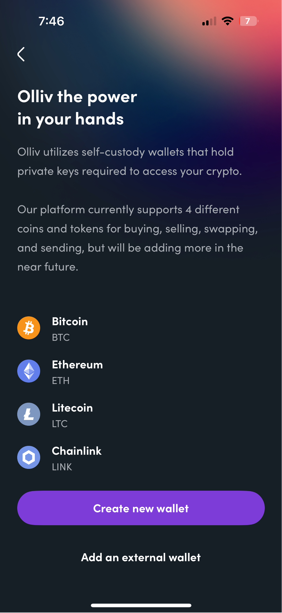
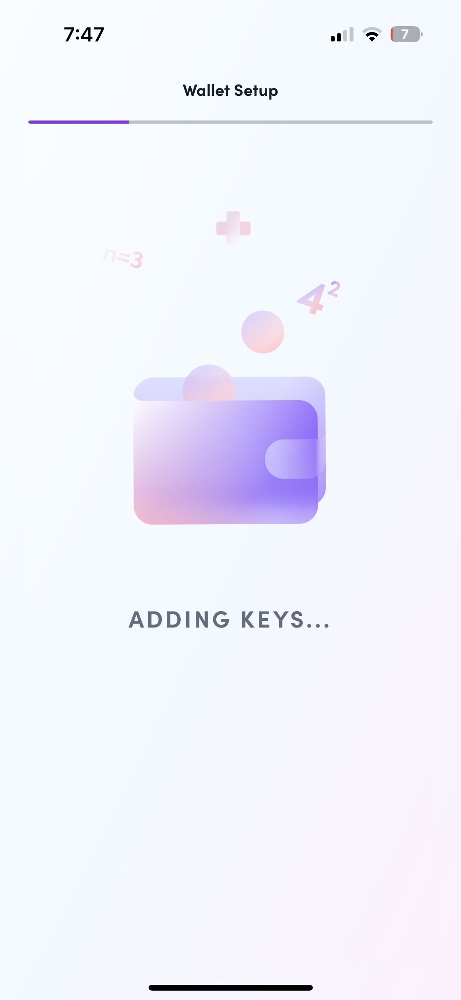
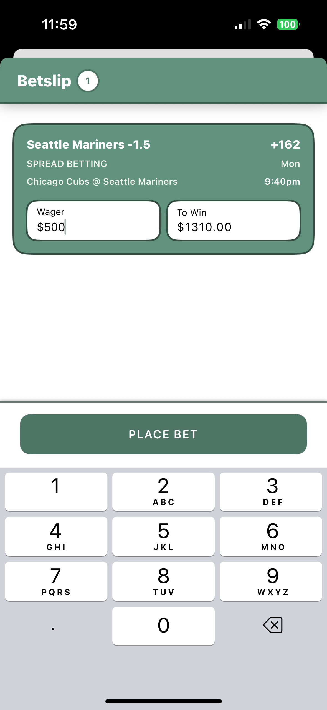
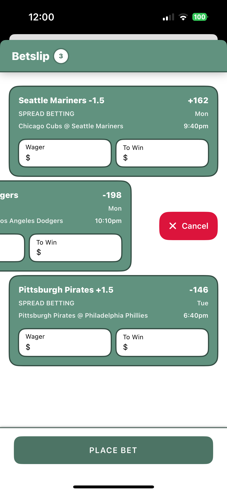
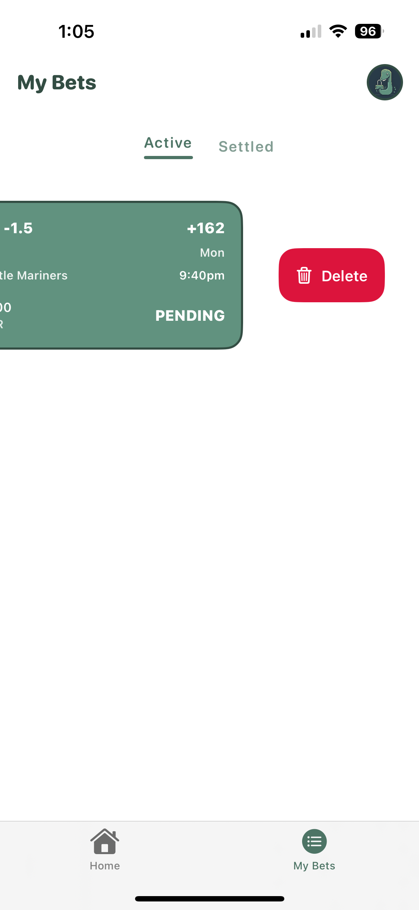
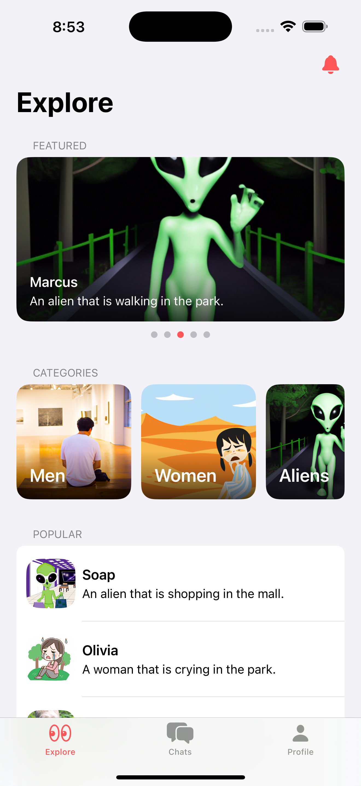

# 📁 Desmond Fitch's iOS Portfolio

A complete portfolio of my iOS development work, divided into professional and personal projects. Use the table of contents to jump directly to a specific section.

---

## 📌 Table of Contents
- [Professional Projects](#professional-projects)
  - [ScannR (DigitalCM)](#scannr-digital-cm)
  - [Olliv (CoinFlip)](#olliv-coinflip)
- [Personal Projects](#personal-projects)
  - [DiscoMuse](#discomuse)
  - [Loch Sports](#loch-sports)
  - [Tracksmith](#tracksmith)
  - [AI Chat Bot](#ai-chat-bot)

---

## 🧑‍💼 Professional Projects

### ScannR (DigitalCM)
- **Company:** Digital CM  
- **Description:** A LiDAR-based scanning app using RoomPlan and RealityKit to generate 3D models and 2D floor plans. Used in architecture and interior design workflows.  
- **Tech Stack:** Swift, SwiftUI, RoomPlan API, RealityKit, SceneKit, SwiftData  
- **Role:** iOS Developer

  
  
  
  
  
  

---

### Olliv (CoinFlip)
- **Company:** CoinFlip  
- **Description:** A cryptocurrency trading platform that simplifies buying, selling, and tracking digital assets. Includes real-time price updates and secure transaction flows.  
- **Tech Stack:** Swift, UIKit, Firebase, Combine, REST APIs  
- **Role:** iOS Engineer

  
  
  
  
  
  

---

## 🛠️ Personal Projects

### DiscoMuse
- **TestFlight:** https://testflight.apple.com/join/ABEjB72J 
- **Description:** A music discovery app that mimics dating app UX—users browse song previews one at a time, can like or skip tracks, and search for the type of music they want recommended.
- **Tech Stack:** SwiftUI, MusicKit, Spotify API, Firebase, RevenueCat
  

  
  
  
  
  
  

---

### Loch Sports
- **TestFlight:** https://testflight.apple.com/join/tEqxXTCN
- **Description:** A virtual sportsbook app where users can place bets, manage bankrolls, and track stats weekly like a real bettor.  
- **Tech Stack:** SwiftUI, SwiftData, Sports Data API
  

  
  
  
  
  

---

### Tracksmith
- **TestFlight:** https://testflight.apple.com/join/MgNNMQvS
- **Description:** A smart Apple Music playlist creator that auto-generates and filters tracks based on play count, artist, title and date added and many more! Designed for quick playlist management and curation.  
- **Tech Stack:** SwiftUI, SwiftData, MusicKit, Firebase

  
  
  
  
  

### AI Chat Bot
- **TestFlight:** https://testflight.apple.com/join/MgNNMQvS
- **Codebase:** https://github.com/breakphast/AIChatbot
- **Description:** A modular AI-powered chat app where users can generate custom avatars and chat with them in real time. Built as part of the Advanced Architecture course by Swiftful Thinking.  
- **Tech Stack:** SwiftUI, Firebase, SwiftData, RevenueCat, OpenAI, XCode Cloud

  
  
  
  
  
  

